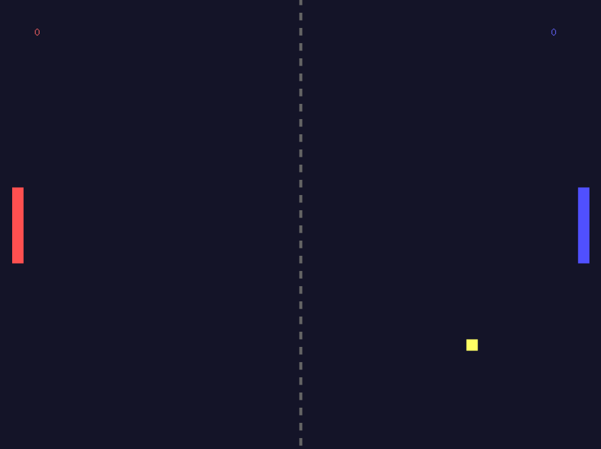

# 🏓 Ping-Pong Game

Простая и красивая реализация классической игры Ping-Pong на языке Go с использованием библиотеки Ebitengine.

## ✨ Особенности

- 🎮 Плавное управление
- 🎯 Реалистичная физика мяча
- 📊 Система счета
- ⏯️ Меню паузы
- 🎨 Приятный визуальный стиль
- 🔄 Интерактивные кнопки

## 🕹️ Управление

**Левый игрок:**

- `W` - движение вверх
- `S` - движение вниз

**Правый игрок:**

- `Стрелка вверх` - движение вверх
- `Стрелка вниз` - движение вниз

**Общее:**

- `ESC` - пауза/продолжить игру

## 📸 Скриншоты

| Главное меню             | Игровой процесс         | Меню паузы                |
| ------------------------ | ----------------------- | ------------------------- |
|  |  |  |

## 🚀 Установка и запуск

1. Убедитесь, что у вас установлен Go (версия 1.16 или выше)
2. Клонируйте репозиторий:

```bash
git clone https://github.com/Kirutka/ping-pong
cd ping-pong
```

3. Установите зависимости:

```bash
go mod init ping-pong
go mod tidy
```

4. Запустите игру:

```bash
cd cmd
go run main.go
```

## 📦 Сборка

Для сборки исполняемого файла:

```bash
go build -o ping-pong main.go
```

## 🛠 Технологии

- **Go** - основной язык программирования
- **Ebitengine** - игровой движок
- **Векторная графика** - для отрисовки элементов игры

## 📄 Лицензия

Этот проект распространяется под лицензией MIT. Подробнее см. в файле LICENSE.md
